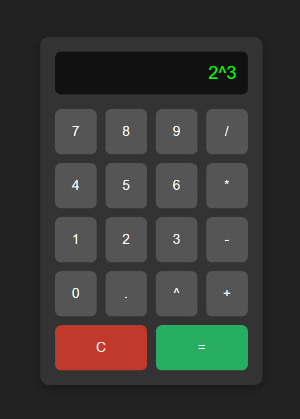
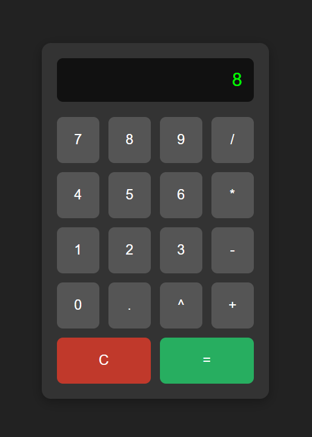

# Calculator

A simple web-based calculator built with **HTML**, **CSS**, and **JavaScript**.

Supports the following operations:
- Addition (`+`)
- Subtraction (`-`)
- Multiplication (`*`)
- Division (`/`)
- Exponentiation (`^`)

---

## Example: Exponentiation

Here's a sample calculation:

**Input:**  

**Output:**  

> Screenshot below shows how it looks in action:

## Demo

Open `index.html` in any browser and start calculating.

---

## Features

- Minimalist, clean UI
- Custom CSS styling (no frameworks)
- Pure JavaScript logic
- Keyboard-free usability

---

## Author

**Shalini Dubey**
